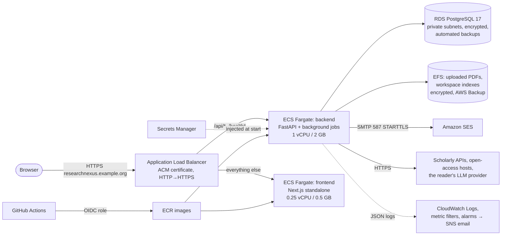

# AWS architecture

ResearchNexus runs on AWS as **two containers on ECS Fargate behind one
HTTPS Application Load Balancer, with RDS PostgreSQL for data, EFS for
uploaded PDFs, Amazon SES for email, Secrets Manager for secrets and
CloudWatch for logs and alarms.** Everything is described in two
CloudFormation templates (`infra/cloudformation/`), and the deploy pipeline is
`.github/workflows/deploy.yml`.

## Why this shape

The deciding facts are in the code, not the service catalogue:

1. **Background jobs run inside the backend process.** Ingesting a PDF,
   discovery, full-text retrieval and gap finding start as FastAPI
   background tasks and keep using CPU after the HTTP response has gone out.
   **App Runner** throttles CPU between requests, so those jobs would crawl,
   and it can't mount EFS. **Lambda** can't run them at all (minutes-long
   work, a 70 MB model held in memory). **ECS Fargate** gives the process a
   steady CPU, runs the same image as `docker compose`, and needs no
   servers to patch.
2. **Files live on a filesystem.** Uploaded PDFs and workspace indexes are
   read and written as files (`RESEARCHNEXUS_DATA_DIR`). **EFS** mounts
   straight into the container at `/data`, so the storage code is unchanged
   and every container sees the same files. (S3 would need a storage layer
   rewrite for no gain at this scale.)
3. **Sessions and the API must share an origin.** Sign-in cookies are
   `__Host-` prefixed, `SameSite=Lax` and CSRF-protected. Serving the
   frontend and `/api` from one address through one load balancer keeps
   that simple and strict (no cross-site cookies, a tight
   Content-Security-Policy) and means one TLS certificate. Hosting the
   frontend on **Amplify** would split it onto a second origin and a second
   deployment system for no benefit; both containers deploy the same way.
4. **The data is relational and multi-user.** SQLite is fine on a laptop
   but can't be shared safely by several containers (and SQLite on a
   network filesystem corrupts). **RDS PostgreSQL** is managed (backups,
   patching, optional Multi-AZ) and every migration is tested on PostgreSQL
   in CI.
5. **CPU only.** The one model the server runs (`bge-small-en-v1.5`, ONNX
   Runtime) is CPU-native and baked into the image, so no GPU instances.

What was deliberately left out, to keep cost and moving parts down:

| Service | Why not (yet) |
|---|---|
| NAT gateway | ~$33/month + data. The containers sit in public subnets with public IPs, but their security groups accept traffic **only from the load balancer**; they need outbound internet for the scholarly APIs, LLM providers and SES. The database and EFS are in private subnets with no internet route. |
| CloudFront | The app is dynamic and per-user; static assets are small and already cached by browsers. Add it later for a global audience. |
| AWS WAF | ~$10+/month. The app rate-limits sign-in itself and the load balancer drops malformed headers. Worth adding for a public launch with attack traffic. |
| ElastiCache / SQS | Not needed: rate limits, sessions and job state live in PostgreSQL; jobs run in-process with a heartbeat so several backend containers can coexist safely (`backend/app/jobs/runners.py`). |
| Container Insights | Per-metric charges; the CPU/memory alarms use the free ECS service metrics. |
| Interface VPC endpoints | ~$7/month each per AZ; public endpoints over TLS are used instead. |

## Components

| Component | Configuration | Template resource |
|---|---|---|
| Network | VPC with 2 public subnets (load balancer, containers) and 2 private (database, EFS) across 2 AZs | `Vpc`, `PublicSubnet*`, `PrivateSubnet*` |
| Load balancer | internet-facing ALB; :80 redirects to :443; TLS 1.2/1.3 policy; `/api/*` and `/health*` → backend, the rest → frontend; 300 s idle timeout (streamed chat answers) | `LoadBalancer`, `HttpsListener`, `BackendRoute` |
| Backend | Fargate, 1 vCPU / 2 GB, desired 1 (raise freely), rolling deploys (100%/200%) with circuit-breaker rollback, health check `/health/ready` | `BackendService`, `BackendTaskDefinition` |
| Frontend | Fargate, 0.25 vCPU / 0.5 GB, Next.js standalone server, non-root | `FrontendService` |
| Database | RDS PostgreSQL 17, db.t4g.micro, gp3 20 GB (autoscaling to 200 GB), encrypted, not public, 7-day automated backups, deletion protection, final snapshot on delete, password managed by RDS in Secrets Manager | `Database` |
| Files | EFS encrypted, elastic throughput, IA after 30 days, AWS Backup on, access point as the container's uid 10001, IAM-authorized mount | `FileSystem`, `DataAccessPoint` |
| Secrets | the app secret (secret key, key-vault key, SES SMTP credentials) and the RDS-managed password, injected into the task at start | `TaskExecutionRole` (read only those two) |
| Email | Amazon SES SMTP interface, verified domain with DKIM | outside the stack (AUTHENTICATION.md) |
| Logs and alarms | CloudWatch Logs (30-day retention), metric filters on the JSON logs (unhandled errors, email failures, failed sign-ins, job failures, provider failures, interrupted jobs), alarms for 5xx, no healthy backend, p90 latency, CPU, memory, database CPU and storage → SNS email | `*Alarm`, `*Metric` |
| Images | ECR, immutable tags (git SHA), scan on push, last 30 kept (rollback targets) | `bootstrap.yml` |
| Deploy access | GitHub OIDC → `researchnexus-github-deploy` role, limited to pushing these two repositories and rolling out these ECS services; only from the repo's `staging`/`production` environments | `bootstrap.yml` |

**Least privilege.** The backend's task role can only mount its EFS access
point; it needs no other AWS API (email goes over SMTP). The frontend's task
role has no permissions. The execution role reads exactly two secrets. The
deploy role can't touch the database, the network, IAM (beyond passing the
three task roles) or CloudFormation (beyond reading the stack's outputs).

**Scaling.** Raise `BackendDesiredCount` / `FrontendDesiredCount`, or the
task sizes. Several backend containers are safe: rate limits and sessions are
in PostgreSQL, and a job is marked "cut off" only once the container running
it has stopped beating (it never fails jobs another live container is
running). Keep `(DB_POOL_SIZE + DB_MAX_OVERFLOW) x backend containers` under
the database's connection limit, or move up an instance class.

## Estimated monthly cost

On-demand prices, us-east-1, low traffic (a class or a lab; tens of users),
one environment running 24/7. These are estimates to check in the
[AWS Pricing Calculator](https://calculator.aws/) for your region; they
exclude tax and the free tier.

| Item | Assumption | ~USD / month |
|---|---|---|
| Fargate, backend | 1 vCPU + 2 GB x 730 h | 36 |
| Fargate, frontend | 0.25 vCPU + 0.5 GB x 730 h | 9 |
| Application Load Balancer | 730 h + ~1 LCU | 22 |
| Public IPv4 addresses | 2 for the ALB + 1 per container (2) at $0.005/h | 15 |
| RDS PostgreSQL | db.t4g.micro single-AZ + 20 GB gp3; backups within the free allowance | 14 |
| EFS | ~5 GB, mostly infrequent access, plus backup | 2 |
| CloudWatch | ~3 GB logs ingested, 11 alarms | 3 |
| Secrets Manager | 2 secrets | 1 |
| ECR | images kept for rollback | 1-2 |
| SES | a few thousand emails | < 1 |
| Route 53 | one hosted zone (if DNS is on Route 53) | 0.5 |
| **Total, one environment** | | **≈ $105** |
| Production with Multi-AZ RDS | `DbMultiAz=true` | + $16 |
| Staging + production | both 24/7 | ≈ $225 |
| Staging when idle | services scaled to 0, RDS stopped (up to 7 days at a time); ALB, IPs and storage still bill | ≈ $45 |

**Costs that grow** and are worth watching: Multi-AZ or a larger RDS class
(doubles the database line), more or bigger backend containers (Fargate
scales linearly), CloudWatch logs at `DEBUG` level, EFS if many large PDFs are
uploaded (mostly IA at $0.016/GB), NAT gateways or interface endpoints if
added later ($33+ and $7+ per month each), WAF, and data transfer beyond the
free 100 GB/month. Language-model calls are paid by each person, with their
own key, to their own provider -- not by this AWS account.

## What is not automated

Creating the AWS account, the DNS records, the ACM certificate's validation,
SES domain verification and production access, the GitHub environments and
the first stack deployments need an account owner -- and cost money -- so
they are steps in [DEPLOYMENT.md](DEPLOYMENT.md), not something the code does.
